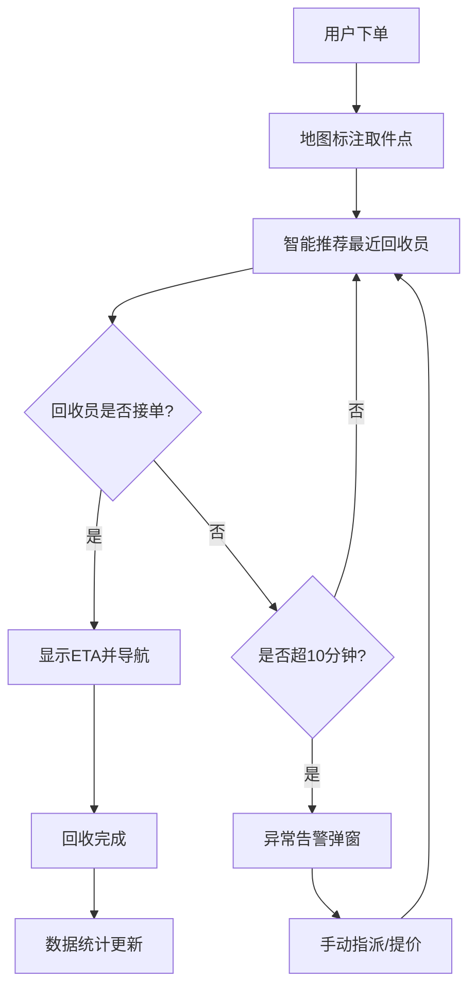

## 1. 产品概述

废品回收调度管理面板系统，面向城市废品回收运营场景，为调度员提供可视化的回收员管理、订单智能调度、数据分析及异常处理一体化平台。
- 解决传统废品回收调度效率低、响应慢、数据分散的痛点
- 提升回收运营效率，降低调度成本，优化用户体验

## 2. 核心功能

### 2.1 用户角色
| 角色 | 登录方式 | 核心权限 |
|------|---------|---------|
| 调度管理员 | 账号密码登录 | 地图监控、订单调度、数据统计、异常处理、回收员管理 |

### 2.2 功能模块
1. **地图可视化模块**：城市地图展示、回收员实时位置标记、用户订单取件位置标注
2. **智能调度模块**：就近回收员推荐、预估到达时间计算、导航路线指引
3. **数据统计模块**：区域订单统计、回收员工作效率排行榜
4. **异常处理模块**：超时订单告警、手动指派、提价激励策略

### 2.3 页面详情
| 页面名称 | 模块名称 | 功能描述 |
|---------|---------|---------|
| 调度管理主面板 | 左侧统计卡片 | 展示今日总订单、已完成订单、在线回收员、平均响应时长等核心指标 |
| 调度管理主面板 | 中央地图区 | Leaflet地图，实时显示回收员位置（绿/橙/灰色图标区分状态）和订单取件点 |
| 调度管理主面板 | 右侧订单列表 | 待接单/进行中/已完成订单列表，支持筛选和操作 |
| 调度管理主面板 | 底部排行榜 | 回收员效率排行榜，支持按接单量/回收重量/收入排序 |
| 订单调度弹窗 | 回收员推荐 | 显示距离最近的3位空闲回收员及ETA |
| 订单调度弹窗 | 导航指引 | 展示回收员到取件点的路线信息 |
| 异常告警弹窗 | 超时提醒 | 下单超10分钟未接单自动弹出，支持手动指派和提价操作 |
| 区域统计面板 | 区域数据 | 按区域展示今日订单量、已完成量、平均响应时长 |

## 3. 核心流程

用户下单 → 系统在地图标注取件位置 → 自动推荐最近空闲回收员 → 显示ETA → 回收员接单 → 导航指引 → 完成回收 → 数据统计更新
若超过10分钟无人接单 → 弹出异常告警 → 调度员手动指派或提价激励 → 回收员接单

## 4. 用户界面设计

### 4.1 设计风格
- 主色：深绿色 (#10b981) - 体现环保回收主题
- 辅色：橙色 (#f59e0b) - 表示忙碌/警告状态
- 中性色：深灰 (#1f2937) / 浅灰 (#f3f4f6)
- 按钮风格：圆角8px，微阴影，hover上浮效果
- 字体：中文使用 "PingFang SC"，数字使用 monospace 字体
- 布局：三栏式仪表盘布局，采用卡片化设计
- 图标：使用简洁线性图标

### 4.2 页面设计概述
| 页面名称 | 模块名称 | UI元素 |
|---------|---------|-------|
| 调度主面板 | 顶部导航栏 | 品牌logo、时间显示、管理员信息、深色/浅色模式切换 |
| 调度主面板 | 统计卡片区 | 4个指标卡片，带渐变背景和趋势指示 |
| 调度主面板 | 地图区域 | 全屏Leaflet地图，带图层控制、缩放控件、回收员图例 |
| 调度主面板 | 订单侧栏 | 可折叠侧边栏，订单卡片列表，标签页切换 |
| 调度主面板 | 排行榜 | 表格展示，支持排序切换，前三名高亮 |
| 调度弹窗 | 推荐卡片 | 回收员头像、距离、ETA、接单率评分、派单按钮 |
| 异常弹窗 | 告警条 | 红色闪烁告警、倒计时、操作按钮组 |

### 4.3 响应式
- Desktop-first设计，支持1280px及以上分辨率
- 平板模式：订单侧栏变为底部抽屉
- 移动端：统计卡片纵向排列，地图全屏展示，排行榜折叠
