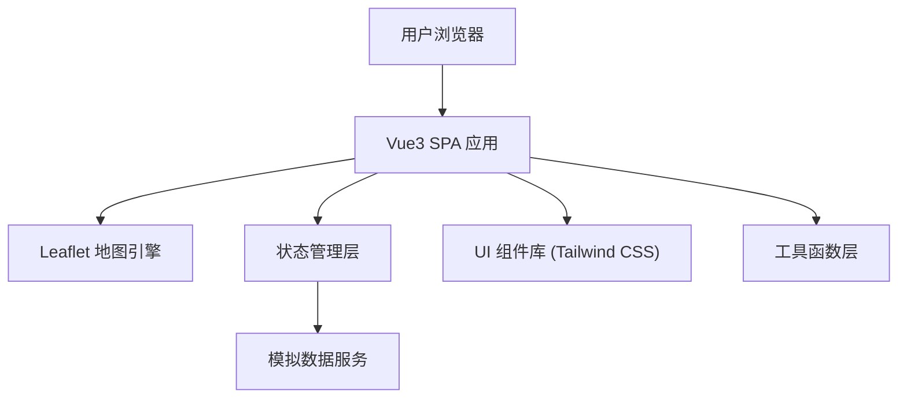

## 1. 架构设计



## 2. 技术说明

- 前端：Vue@3 + TypeScript + Vite
- 地图库：Leaflet@1.9 + leaflet.chinatmsproviders
- 样式：Tailwind CSS@3
- 状态管理：Vue Composition API (reactive/ref)
- 数据层：纯前端 Mock 数据 + setInterval 模拟实时更新
- 图标：lucide-vue-next

## 3. 路由定义

| 路由 | 页面 | 说明 |
|------|------|------|
| / | Dashboard 调度管理主面板 | 地图、订单、统计一体化面板 |

## 4. 数据模型

### 4.1 回收员 (Collector)
```typescript
interface Collector {
  id: string
  name: string
  avatar: string
  phone: string
  status: 'online' | 'busy' | 'offline'
  location: { lat: number; lng: number }
  stats: {
    ordersToday: number
    totalWeight: number
    totalIncome: number
    acceptRate: number
  }
  regionId: string
}
```

### 4.2 订单 (Order)
```typescript
interface Order {
  id: string
  userId: string
  userName: string
  userPhone: string
  address: string
  location: { lat: number; lng: number }
  category: 'paper' | 'plastic' | 'metal' | 'electronic' | 'mixed'
  estimatedWeight: number
  status: 'pending' | 'accepted' | 'completed' | 'cancelled'
  createdAt: number
  acceptedAt?: number
  completedAt?: number
  collectorId?: string
  regionId: string
  priceMultiplier: number
}
```

### 4.3 区域 (Region)
```typescript
interface Region {
  id: string
  name: string
  bounds: [[number, number], [number, number]]
  stats: {
    totalOrders: number
    completedOrders: number
    avgResponseTime: number
  }
}
```

## 5. 目录结构

```
src/
├── components/
│   ├── MapView.vue          # Leaflet地图组件
│   ├── StatCard.vue         # 统计卡片
│   ├── OrderList.vue        # 订单列表
│   ├── OrderCard.vue        # 单个订单卡片
│   ├── CollectorRank.vue    # 回收员排行榜
│   ├── RegionStats.vue      # 区域统计面板
│   ├── DispatchModal.vue    # 调度弹窗
│   ├── AlertModal.vue       # 异常告警弹窗
│   └── NavHeader.vue        # 顶部导航
├── composables/
│   ├── useCollectors.ts     # 回收员数据逻辑
│   ├── useOrders.ts         # 订单数据逻辑
│   ├── useDispatch.ts       # 智能调度逻辑
│   └── useMapMarkers.ts     # 地图标记逻辑
├── data/
│   └── mock.ts              # 模拟数据生成
├── types/
│   └── index.ts             # 类型定义
├── utils/
│   ├── distance.ts          # 距离计算
│   └── format.ts            # 格式化工具
├── App.vue
└── main.ts
```

## 6. 核心算法

### 6.1 最近回收员推荐
- 使用 Haversine 公式计算两点间球面距离
- 筛选 status='online' 且无进行中订单的回收员
- 按距离升序取前 3 名，计算 ETA（距离 ÷ 平均速度 15km/h）

### 6.2 ETA 计算
```
ETA(分钟) = 距离(km) / 15(km/h) * 60 + 基础等待(2min)
```

### 6.3 超时检测
- 定时器每 30 秒轮询
- 检测 status='pending' 且 `Date.now() - createdAt > 10*60*1000` 的订单
- 触发异常告警弹窗
